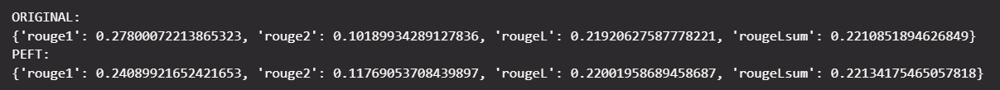
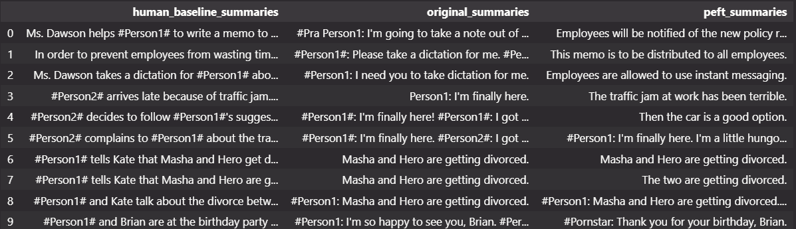
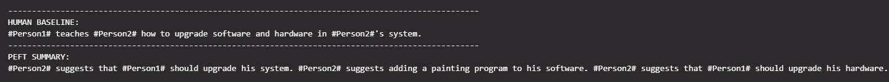

# Laci-bot

## 1. Hét

### LLM:

- Prompt: tipikusan ezen keresztül kap a model bemenetet
- Context window: a prompt memória és tárhely megkötései
- Completion: model kimenete

### Transformer architecture:


Hatalmas ereje annak köszönhető, hogy képes a mondat összes szavának a kontextusát és relevanciáját megtanulni.

High level:

    Encoder és Decoder komponensek

Flow:

    1. Szavak tokenizálása
    2. Embedding layer: tekenek elhelyezése egy vektortérbe
    3. Positional encoding
    4. Self attention súlyok több párhuzamos rétegekben (eltérő fokusszal)
    5. Feed forward network: valószínűségek hozzárendelése a vektorokhoz
    6. Softmax: normalizálja a vektorokat

Lásd bővebben [Attention Is All You Need paper](https://arxiv.org/pdf/1706.03762.pdf)

### Generative AI lifecycle:


### Prompt engineering

    TODO

### Labor útravalók:

- prompt engineering hasznos arra, hogy kipróbáljuk a modelt
- 5-6 shot után nem igazán javítható prompt engineering-el a model

## 2. Hét

### Fine-tuning

- In-context learning (ICL) plafonba tud ütközni, főleg kisebb modellek esetén
- Pre-trained model =/= Fine-tuned model
- Ellenőrzött tanulás esetén címkézett adatokkal módosítjuk a modell súlyait
- Fajtái:
  - Instruction fine-tuning
- Training, Validation és Test datasets
- Catastophic forgetting veszélye single task fine-tuning esetén
- Full fine-tuning rengeteg erőforrást és adatot igényel

### Parameter efficient fine-tuning (PEFT)

    TODO

### Eveluation:

    TODO

### Labor útravalók:

- 1 epoch után:





    miért ez az eredmény?

- mikor áll le a training? meddig érdemes futtatni? cpu helyett gpu?

## 3. Hét

### CUDA

A sikeres futtatáshoz korábbi driver-re és másik pytorch-ra volt szükség ez után jelentős időjavulás következett be a fine-tuning során.

20 epoch után már megütötte a few-shot szintet: 

A week 3-ból úgy gondolom a RAG lehet, aminek nagy hasznát veszem a későbbiekben a többi része az anyagnak a projekt szempontjából kevésbé érződött relevánsnak (RLHF).

Ezen kívül a LongChain-es kurzusba is beelkezdtem + Alpha signal-on látott hírek alapján a HuggingChat-et is kipróbáltam.

## 4-5. Hét

### gpt-3.5-turbo és Gradio

A chat with your data kurzusból inspirálódva egy egyszerű, saját dokumentot forrásént használó chatbot készítése a Gradio-t alkalmazva demo-hoz.

## 6-7. Hét

### Fordítás

Promt engineering után, arra a következtetésre jutottam, hogy kellően jól megfogalmazott kérdés vagy elég kontextus biztosítása a gpt-3.5-turbo modell alkalmazása elegendő további fordító rétegek nélkül is. Ennek néhány pillanatképét a test mappában találjuk.

### RAG

A [szakmai gyakorlat](https://www.aut.bme.hu/SzakmaiGyakorlat/) oldalán található információk .csv, .pdf és .txt formátumokba szervezése és egy olyan chatbot létrehozása, ami az ezekből az adatokból válaszol a témával kapcsolatos kérdésekre (némi easter egg-el). A futtatáshoz szükség van egy venv-re és az alábbi parancs kiadására:

```pyhon
pip install -r requirements.txt
```
